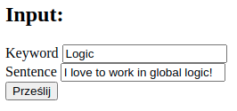
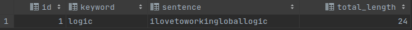
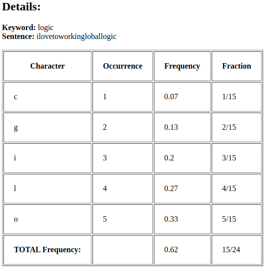

# CountOccurrences-Web

## Table of elements
* [Description](#description)
* [Technogy Stack](#technogy-stack)
* [Testing](#testing)

## Description
>Algorithm counts number of occurrences between keyword and phrase.  Run Spring Boot application, use website address: http://localhost:8080/input. Enter both inputs and clik submit button (input example).  Special characters and white spaces are removed, afterwards strings are being saved into mysql (database example). Finally, all necessary information are displayed on the screen (output example).

## Technogy Stack
* Java
* Spring MVC
* MySQL
* JSP

## Testing
#### Input example

#### Database example

#### Output example

